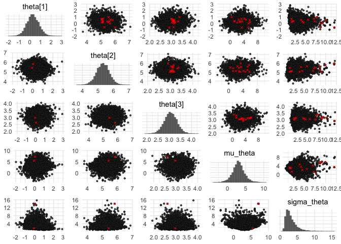

## Setup


```r
library(rstan)
options(mc.cores = parallel::detectCores())
rstan_options(auto_write = TRUE)
library(broom)
library(dplyr)
library(ggplot2)
library(bayesplot)
library(gridExtra)
```


```r
plot_estimates <- function(fit, stan_data) {
    tidy(fit, pars = "theta", conf.int = TRUE) %>%
        bind_cols(naive = tapply(
            stan_data$y, stan_data$grp, function(x) mean(log(x)))) %>%
        ggplot(aes(estimate, term)) +
        geom_linerange(
            aes(xmin = conf.low, xmax = conf.high), colour = "orange", size = 3) +
        geom_point(shape = 21, size = 2.5, fill = "white") +
        geom_point(aes(naive, term), shape = 21, size = 4) +
        geom_vline(
            xintercept = mean(tapply(
                stan_data$y, stan_data$grp, function(x) mean(log(x)))),
            linetype = 3) +
        theme_minimal()
}
```

## Data


```r
# Data
N <- c(5, 10, 20)
mu <- c(1, 5, 2.7)
set.seed(2020)
grp <- rep(seq_along(N), times = N)
y <- unlist(Map(function(n, meanlog) rlnorm(n, meanlog), N, mu))
stan_data <- list(N = sum(N), J = length(N), y = y, grp = grp)
```

## Models {.tabset}

### Centred-parametrisation

$$
\begin{aligned}
y_i &\sim \textrm{LogNormal}(\theta_{j[i]}, \sigma^2)\,,\\
\theta_j &\sim \textrm{Normal}(\mu_\theta, \sigma_\theta^2)
\end{aligned}
$$
with priors
$$
\begin{aligned}
\sigma &\sim \textrm{Cauchy}(0, 2.5)\,,\\
\mu_\theta &\sim \textrm{Normal}(\text{mean}(\log{y}), 5)\,,\\
\sigma_\theta &\sim \textrm{Cauchy}(0, 2.5)\,.
\end{aligned}
$$

Model fit

```r
mod1 <- stan_model("cp_lognormal.stan")
fit1 <- sampling(object = mod1, data = stan_data, iter = 4000, seed = 2020)
summary(fit1, pars = c("theta", "mu_theta", "sigma_theta"))$summary
```

```
##                  mean     se_mean        sd       2.5%         25%       50%
## theta[1]    0.2824138 0.006508752 0.5826241 -0.8473542 -0.09846581 0.2754291
## theta[2]    5.3376859 0.004699512 0.4041809  4.5187907  5.07297626 5.3413570
## theta[3]    3.0580520 0.002967625 0.2864168  2.4891563  2.86236885 3.0576336
## mu_theta    2.9246911 0.026373804 1.8648984 -0.9152184  1.86809094 2.9457621
## sigma_theta 3.3292770 0.032916514 2.1642098  1.2496913  2.05277046 2.7801046
##                   75%    97.5%    n_eff      Rhat
## theta[1]    0.6616617 1.451716 8012.749 1.0000274
## theta[2]    5.6124935 6.102726 7396.835 0.9998538
## theta[3]    3.2534492 3.616276 9314.916 1.0000188
## mu_theta    3.9611710 6.741464 4999.940 1.0005051
## sigma_theta 3.9372162 8.707484 4322.859 0.9999944
```

Parameter estimates

```r
plot_estimates(fit1, stan_data)
```

<!-- -->

### Non-centred parametrisation

$$
\begin{aligned}
y_i &\sim \textrm{LogNormal}(\theta_{j[i]}, \sigma^2)\,,\\
\theta_{\text{raw}, j} &\sim \textrm{Normal}(0, 1)\\
\theta_j &= \mu_\theta + \sigma_\theta \theta_{\text{raw}, j}
\end{aligned}
$$
with priors
$$
\begin{aligned}
\sigma &\sim \textrm{Cauchy}(0, 2.5)\,,\\
\mu_\theta &\sim \textrm{Normal}(\text{mean}(\log{y}), 5)\,,\\
\sigma_\theta &\sim \textrm{Cauchy}(0, 2.5)\,.
\end{aligned}
$$

Model fit

```r
mod2 <- stan_model("ncp_lognormal.stan")
fit2 <- sampling(object = mod2, data = stan_data, iter = 4000, seed = 2020)
```

```
## Warning: There were 18 divergent transitions after warmup. Increasing adapt_delta above 0.8 may help. See
## http://mc-stan.org/misc/warnings.html#divergent-transitions-after-warmup
```

```
## Warning: Examine the pairs() plot to diagnose sampling problems
```

```r
summary(fit2, pars = c("theta", "mu_theta", "sigma_theta"))$summary
```

```
##                  mean     se_mean        sd       2.5%         25%       50%
## theta[1]    0.2874341 0.006494988 0.5736216 -0.8284460 -0.08609789 0.2759411
## theta[2]    5.3220404 0.004391849 0.4093376  4.4977139  5.04868842 5.3249077
## theta[3]    3.0644969 0.003102806 0.2854228  2.5044668  2.87820501 3.0633092
## mu_theta    3.0200486 0.039769094 1.7123739 -0.4843552  1.99999219 3.0028987
## sigma_theta 3.1652291 0.040395884 1.6448343  1.2707467  2.03742385 2.7391128
##                   75%    97.5%    n_eff     Rhat
## theta[1]    0.6593399 1.421572 7799.993 1.000028
## theta[2]    5.5914960 6.121670 8686.974 1.000006
## theta[3]    3.2534330 3.622223 8461.901 1.000132
## mu_theta    4.0012489 6.581174 1853.983 1.000884
## sigma_theta 3.8394788 7.619906 1657.945 1.007571
```

Parameter estimates

```r
plot_estimates(fit2, stan_data)
```

<!-- -->

## Diagnostic

We use `bayesplot` to explore results.


```r
color_scheme_set("darkgray")
theme_set(theme_minimal())

posterior1 <- as.array(fit1)
posterior2 <- as.array(fit2)
lp1 <- log_posterior(fit1)
lp2 <- log_posterior(fit2)
np1 <- nuts_params(fit1)
np2 <- nuts_params(fit2)
```


```r
gg1 <- mcmc_parcoord(
    posterior1, 
    pars = c("theta[1]", "theta[2]", "theta[3]", "mu_theta", "sigma_theta"),
    np = np1)
gg2 <- mcmc_parcoord(
    posterior2, 
    pars = c("theta[1]", "theta[2]", "theta[3]", "mu_theta", "sigma_theta"),
    np = np2)
grid.arrange(gg1, gg2)
```

<!-- -->


```r
mcmc_pairs(
    posterior1,
    pars = c("theta[1]", "theta[2]", "theta[3]", "mu_theta", "sigma_theta"),
    np = np1,
    off_diag_args = list(size = 0.75))
```

<!-- -->

```r
mcmc_pairs(
    posterior2,
    pars = c("theta[1]", "theta[2]", "theta[3]", "mu_theta", "sigma_theta"),
    np = np2,
    off_diag_args = list(size = 0.75))
```

<!-- -->
